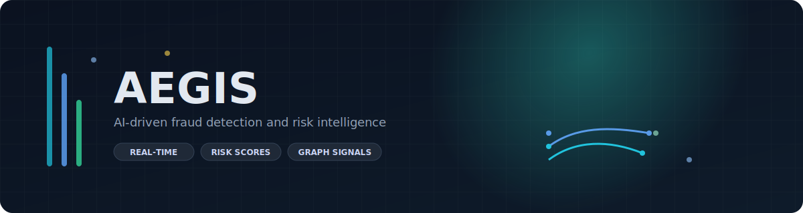
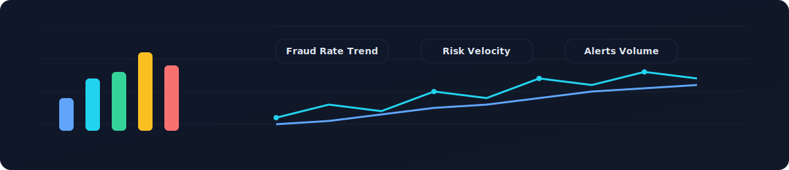
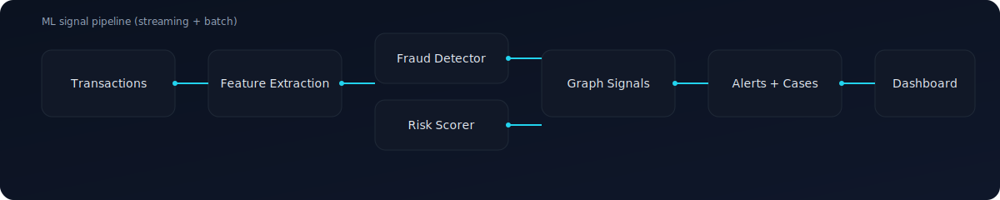
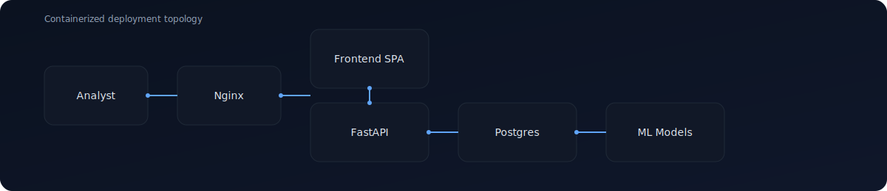
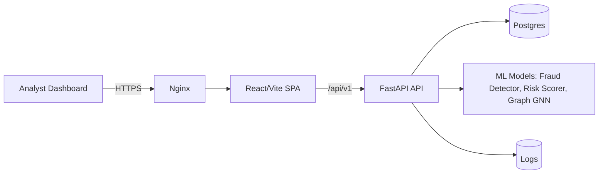

# Aegis

<p align="center">
  
</p>

<p align="center">
  <strong>AI-driven fraud detection and risk intelligence platform</strong>
</p>

<p align="center">
  
  
  
  
  
  
  
  <br/>
  
  
  
  
  
  
</p>

AEGIS combines real-time transaction analysis, risk scoring, and graph-based anomaly detection with a modern analyst dashboard. It is designed to surface high-risk activity early, explain why it is risky, and streamline investigation workflows.

## Contents
- Overview
- Highlights
- Visual overview
- Architecture
- Repo structure
- Getting started
- Configuration
- API surface
- Docker and deployment

## Overview
AEGIS is a full-stack fraud detection platform with a FastAPI backend and a React-based analyst experience. It blends ML scoring, graph intelligence, and alert workflows to provide a clear, explainable picture of risk across accounts and transactions.

## Highlights
- Real-time fraud analysis with ML-powered confidence scoring
- Risk profiling and automated status classification
- Graph intelligence for ring detection and network anomalies
- Alerting and case workflows for investigations
- Metrics dashboard for fraud KPIs and system health

## Visual overview
<p align="center">
  
</p>

## Signal flow
<p align="center">
  
</p>

## Deployment topology
<p align="center">
  
</p>

## Architecture


## Repo structure
- `api/`: FastAPI API, ML models, database layer, and tests.
- `frontend/`: React/Vite frontend for dashboards and monitoring.

## Getting started
### Requirements
- Python 3.11
- Node.js 20
- Docker (optional)

### Local development
#### API
1. `cd api`
2. `cp .env.example .env`
3. `python -m venv .venv && source .venv/bin/activate`
4. `pip install -r ../requirements.txt`
5. `uvicorn app.main:app --reload`

#### Frontend
1. `cd frontend`
2. `npm install`
3. `npm run dev`

### Docker (production)
1. `docker compose up --build`
2. Frontend: `http://localhost:3000`
3. API: `http://localhost:8000`

### Docker (dev workflow)
1. `docker compose -f docker-compose.yml -f docker-compose.dev.yml up --build`
2. Frontend (Vite dev): `http://localhost:3000`
3. API (reload): `http://localhost:8000`

## Configuration
- API settings live in `api/.env` (see `api/.env.example`).
- Key variables: `DATABASE_URL`, `SECRET_KEY`, `MODEL_PATH`, `FRAUD_DETECTION_THRESHOLD`.
- Frontend can override the API base URL with `VITE_API_URL` (defaults to `/api/v1`).

## API surface
- `GET /health`
- `GET /api/v1/dashboard/metrics`
- `GET /api/v1/fraud/alerts`
- `POST /api/v1/fraud/analyze`
- `GET /api/v1/accounts/monitored`
- `GET /api/v1/compliance/frameworks`

## Docker and deployment
- Dev uses `docker-compose.dev.yml` overrides (bind mounts, hot reload, Vite dev server).
- Prod uses `docker-compose.yml` or `docker-compose.prod.yml` (immutable images + Nginx).
- Config moves via env vars and CI/CD (local `.env` files for dev, real secrets in prod).

## Publishing containers
1. Build and tag images:
```
docker build -t <dockerhub_user>/aegis-api:1.0.0 -f api/Dockerfile .
docker build -t <dockerhub_user>/aegis-frontend:1.0.0 -f frontend/Dockerfile frontend
```
2. Push images:
```
docker push <dockerhub_user>/aegis-api:1.0.0
docker push <dockerhub_user>/aegis-frontend:1.0.0
```
3. In prod, run with Docker Hub images:
```
DOCKERHUB_USERNAME=<dockerhub_user> IMAGE_TAG=1.0.0 \
  docker compose -f docker-compose.prod.yml up -d
```

## Docker Hub CI (GitHub Actions)
This repo includes `.github/workflows/dockerhub.yml` to build and push images on `main`.
Required secrets:
- `DOCKERHUB_USERNAME`
- `DOCKERHUB_TOKEN` (a Docker Hub access token)

## Roadmap
- Model retraining pipeline with scheduled evaluations and drift alerts
- Role-based access control (RBAC) and audit trails for investigations
- Streaming ingest (Kafka/PubSub) for near-real-time decisioning
- Pluggable rules engine for policy-based overrides
- Analyst case timeline with evidence attachments and notes
